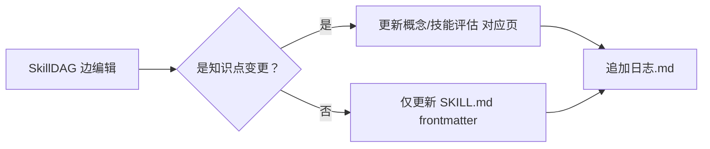
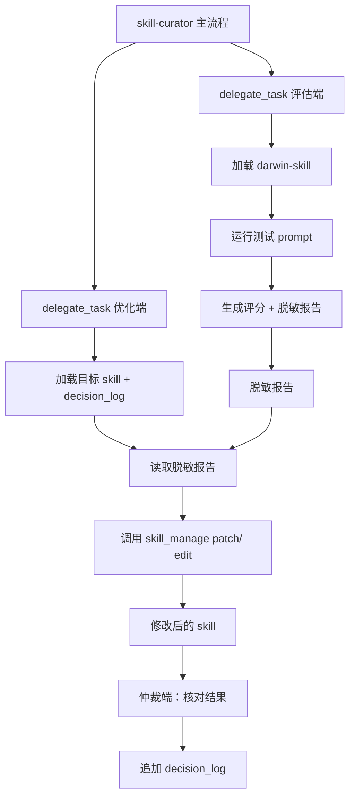
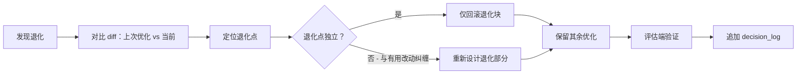

# Skill Curator · 技能管理与持续改进系统

> **核心理念**：你的技能集是一个活的生态系统——需要定期盘点、评估、优化，以及适时淘汰。
> 整合 darwin-skill 2.0 的9维评估 + SkillLens 实证方法论 + 最佳实践。

## 设计哲学

### 核心原则：人是变化的

技能管理系统必须接受一个前提：**用户的偏好、需求、关注点都是流动的。**

- 今天觉得重要的能力，下个月可能已经过时
- 今天写的skill逻辑，下周可能被新发现推翻
- 用户明确说了「不用考虑之前的工作」——说明过往记录不能成为刚性约束

**对skill管理的影响**：
- 技能集的评估必须是**快照式**的，每次评估标注「评估时间」
- 不要假设「上次优化过的skill现在仍然优秀」——定期重新评分
- 淘汰规则比创建规则更重要——定期清理比不断堆积更有价值
- 用户的偏好变化应记录在 `USER.md` 和 `MEMORY.md`，而非固化在skill逻辑中

### 评估方法论：并行预研 + 基线对比

本系统在创建时使用了以下评估方法，记录为可复用的模式：

当面对大量待评估skill合集时：
1. **并行采集**：用 delegate_task 多subagent同时读取（每个合集一个subagent，节省80%+时间）
2. **结构化输出**：每个subagent返回固定格式的表格（Skill | 功能 | 值得？ | 原因）
3. **对比映射**：将新skill与我们现有skill按功能映射（重叠/互补/全新三类）
4. **优先级排序**：基于使用频率 + 替代方案质量 + 实现成本三维度排序
5. **快照标注**：每次评估标注日期，下次重新评估时能判断时效性

## 依赖

| 组件 | 用途 | 位置 |
|------|------|------|
| **darwin-skill** | 9维评分引擎 + 优化循环 | `~/.hermes/skills/darwin-skill/` |
| **meta-skill-orchestrator** | 工作流编排框架 | `~/.hermes/skills/meta-skill-orchestrator/` |
| **huashu-nuwa** | 新技能蒸馏与创建 | `~/.hermes/skills/openclaw-imports/huashu-nuwa/` |
| **SkillDAG 论文** | 自进化技能图谱方法论 | `arXiv:2606.03056` + `GitHub: Ericbai06/SkillDAG` |

## 已知问题 / Pitfalls

### 添加 frontmatter 字段时 YAML 解析失败（2026-06-18）

修改 SKILL.md 的 frontmatter 时（如添加 `needs:` 字段），描述值中包含引号或中文时极易导致 YAML 解析失败。**症状**：后续 `skill_view()` 加载时报错 `mapping values are not allowed` 或 `expected <block end>`。

**根因**：
- `description: "..."` 中包含 `\"` 转义 — YAML 在解析长字符串时会误判
- 中文 + 冒号组合 `description: 读取、搜索...` 中冒号后的空格被 YAML 当作分隔符处理
- `description: '...'` 单引号内包含 `'` 字符会导致引号提前闭合

**修复规则**：
| 场景 | 正确写法 | 错误写法 |
|------|---------|---------|
| 描述含双引号（如触发词列表） | `description: '...'` 或 `description: \|` | `description: "..."` |
| 描述含中文 | `description: "..."` | `description: 中文无引号` |
| 描述极长（>500字符） | `description: \|` 多行块标量 | 单行 `description: "..."` |
| 描述含单引号 | `description: "..."` | `description: '...'` |

**验证**：修改 frontmatter 后，立即用 Python `yaml.safe_load()` 验证是否能正确解析。

### darwin-skill 版本冲突

当前系统中有两个 darwin-skill 文件，名称相同导致 skill_view 尝试加载时发生歧义：

| 位置 | 大小 | 说明 |
|------|------|------|
| `~/.hermes/skills/darwin-skill/SKILL.md` | 159行（~7KB） | 精简版，缺少runtime适配/成果卡片/扩展异常处理 |
| `~/.hermes/skills/openclaw-imports/darwin-skill/SKILL.md` | 1100+行（完整版） | 完整版，含 9维rubric + Phase 0-3 + runtime gate + result card + 异常表 |

**建议**：合并为一个完整的 darwin-skill，删除精简版。精简版丢失了关键内容（dim9 meta-skill 维度详细评分标准、runtime适配性审查、Phase 2.5探索性重写、成果卡片生成、扩展异常表）。

### pre-publish 安全检查清单

在将 skill 发布到 SkillHub、GitHub 仓库或分享给外部之前，**必须**执行安全检查：

| 检查项 | 扫描模式 | 常见泄漏源 | 修复方法 |
|--------|---------|-----------|---------|
| 绝对路径 | `C:\\Users\|D:\\Documents` | SKILL.md、references/ 内的笔记 | 替换为"用户配置的路径"等泛化描述 |
| 用户 Home 路径 | `~/.hermes/skills/×/×/SKILL.md` | frontmatter、正文代码块 | 删除具体路径或改为 `~/.hermes/skills/` 通配形式 |
| decision_log 目录结构 | `decision_log/` 下具体文件名 | SKILL.md 中的目录树示例 | 删除目录树，保留 `decision_log/` 作为概念提及 |
| 内部脚本路径 | 脚本中的硬编码 `os.path.expanduser()` / 绝对路径 | scripts/*.py | 改为环境变量配置（HERMES_SKILL_BASE / GIT_PROJECT_BASE） |
| 内部文件引用 | `results.tsv`、`test-prompts.json`、`dag_audit_log.json` | SKILL.md 中的具体文件名 | 泛化为"测试用例集""审计日志"等 |
| 端口号/内网IP | `192.168.`、`10.0.`、特定端口 | 配置示例、命令注释 | 删除或替换为通用占位符（文档示例中的模式匹配字符串不计泄漏） |
| 邮箱/用户名 | `@` 模式、GitHub username | 任何位置 | 删除 |

**执行方法：**
```python
# 一键检查整个 skill 目录（包括 references/ 和 scripts/）
import os, re
base = "~/AppData/Local/hermes/skills/<category>/<skill-name>/"
checks = {
    "绝对路径": r'(?:C:\\Users|D:\\Documents)',
    "用户Home路径": r'~/.hermes/skills/[a-z]+/[a-z-]+/SKILL\\.md',
    "内网IP": r'\\b(?:192\\.168\\.\\d+\\.\\d+|10\\.\\d+\\.\\d+\\.\\d+)\\b',
    "邮箱": r'[a-zA-Z0-9._%+-]+@[a-zA-Z0-9.-]+\\.[a-zA-Z]{2,}',
    "端口号": r'\\b(?:3200|54321|3000|9128|11434|9999|14013|14023|18888)\\b',
}
# 用 os.walk(base) 扫描所有文件（.md / .py / .json），发现即拦截
```

**经验教训：**
- **必须扫描整个目录** — SKILL.md、references/、scripts/ 都可能泄漏（决策日志、配置笔记、同步脚本都曾藏路径）
- decision_log/ 目录结构描述是高频泄漏源 — 只保留概念提及，不要展示具体 JSON 文件名
- 脚本中的硬编码路径必须用环境变量替代 — 发布后别人不会用你的路径
- 发布前用上述脚本全目录扫描，确认零泄漏后再打包/推送到 GitHub

### ClawHub 发布流程

**⚠️ `hermes skills publish --to clawhub` 目前不支持命令行发布**（返回 "ClawHub publishing is not yet supported. Submit manually at https://clawhub.ai/submit"）。

正确流程：
1. 先执行上述安全检查，清理所有本地路径
2. 将 skill 目录推送到 GitHub（`git add -A && git commit && git push`）
3. 在 ClawHub 网站手动提交，或通过 GitHub 同步功能自动拉取
4. 如果 ClawHub 扫描器报告 `os.environ.get()` / `subprocess.run()` 等，这些都是 **false positive**（环境变量配置读取、标准 subprocess 调用），可在提交说明中备注

`skill-curator` 这个名字在两个位置都有：
- `~/.hermes/skills/skill-curator/SKILL.md`（根级，可能为空或旧版本）
- `~/.hermes/skills/software-development/skill-curator/SKILL.md`（实际使用，v1.2.0+）

**注意**：`skill_view` 和 `skill_manage` 在两个同名 skill 存在时会报错「Ambiguous skill name」。操作时：
- `skills_list` 显示 `skill-curator` 在 `software-development` 分类下
- 但 `skill_manage(action='patch|edit|delete')` 用裸名 `skill-curator` 可以命中实际那个
- 避免用 `skill-view` 加载——它要求指定分类路径

## 1. SKILL 全景仪表盘

### 1.1 盘点指令

```bash
# 统计所有已安装skill
ls ~/.hermes/skills/*/SKILL.md | wc -l

# 按分类统计
ls -d ~/.hermes/skills/*/
```

### 1.2 分类矩阵

| 类别 | 已有skill数 | 健康状况 | 优化建议 |
|------|-----------|---------|---------|
| **内容创作** | wechat-article-formatting, tiaoman-creation, pai-ban-gong | 🟡 已优化 | 3个全优化 |
| **图像/视频生成** | agnes-ai-integration, custom-image-video-gen | 待评估 | ⬇ |
| **角色/视角** | shui-bing-yue-perspective + 14个花叔示例 | 🟢 已优化 | 1个已完成 |
| **配图/封面/信息图** | baoyu-article-illustrator, baoyu-cover-image, baoyu-infographic, baoyu-diagram, baoyu-image-gen | 🆕 待评估 | 5个新装 |
| **开发工具** | github-*, plan, writing-plans, systematic-debugging, project-repair, TDD, spike, subagent-driven-development | 待评估 | ⬇ |
| **AI/MCP/自治** | native-mcp, claude-code, codex, hermes-agent, opencode | 待评估 | ⬇ |
| **数据/分析** | jupyter-live-kernel, dspy, llama-cpp, huggingface-hub, weights-and-biases | 待评估 | ⬇ |
| **生产力** | airtable, google-workspace, linear, maps, nano-pdf, notion, ocd, powerpoint, teams-meeting-pipeline | 待评估 | ⬇ |
| **知识管理** | obsidian, auto-classify-knowledge-base, llm-wiki | 待评估 | ⬇ |
| **媒体** | youtube-content, spotify, gif-search, heartmula, songsee | 待评估 | ⬇ |
| **研究** | arxiv, blogwatcher, polymarket | 待评估 | ⬇ |
| **哲学/认知** | qiushi-skill, darwin-skill, ljg-think, ljg-rank, ljg-writes, ljg-paper, ljg-learn | 🆕 待评估 | 2个已有+5个新装 |
| **管理/运维** | hermes-skill-management, hermes-custom-provider, hermes-windows-dependencies, webhook-subscriptions, kanban-* | 待评估 | ⬇ |
| **写作/去AI味** | humanizer-zh, khazix-writer | 🆕 待评估 | 2个新装 |
| **实用工具** | OCR-and-documents, maps, nano-pdf, todo, neat-freak | 🆕 1个新装 | ⬇ |

## 2. 健康评估（darwin-skill 9维评分）

### 基线评分（2026-06-06）

| 技能 | 总分 | 等级 | 关键发现 |
|------|------|------|---------|
| wechat-article-formatting | **78.5** | 🟡 良好 | 流程清晰但缺质检门控 |
| tiaoman-creation | **64.3→~75** | 🟠→🟡 已提升 | 缺 checkpoint 和失败处理链（已修复） |
| shui-bing-yue-perspective | **84.4** | 🟢 优秀 | 反模式清单最佳，已成标杆 |

### 已完成优化

| 技能 | 优化内容 | 来源 |
|------|---------|------|
| wechat-article-formatting | + HKR选题质检（STEP 4） | khazix-writer |
| | + AI腔6类检测（STEP 6） | huashu-proofreading |
| | + S级/及格选题评分标准 | — |
| tiaoman-creation | + frontmatter（name/description/version/triggers） | darwin-skill dim1 |
| | + 7种布局模板表 | baoyu-skills |
| | + 角色一致性流程 + 🔴 CHECKPOINT | canghe-comic |
| | + 反模式清单表（7项） + 失败处理表（3项） | darwin-skill dim3/9 |
| shui-bing-yue-perspective | + HKR质检（写作任务STEP 2） | khazix-writer |
| | + AI腔检测自检列表 | huashu-proofreading |

### 2.1 评估范围优先级

| 优先级 | 选择标准 | 示例 |
|--------|---------|------|
| **P0** | 高频使用但从未优化的skill | wechat-article-formatting, tiaoman-creation |
| **P1** | 有类似skill可对比的 | agnes-ai-integration（vs baoyu-image-gen） |
| **P2** | 低分容易见效的 | 轻量级工具skill |
| **P3** | 已经很完善的高分skill | shui-bing-yue-perspective（非必要不动） |

### 2.2 调用 darwin-skill

```bash
# 方式1：评估单个skill
# 加载 darwin-skill → 按Phase 0.5-1执行

# 方式2：批量评估
# 1. 准备测试用例集
# 2. 对每个 skill 运行基线评估
# 3. 按分数从低到高排序

# 方式3：全量健康检查（只评估不改）
# 加载 darwin-skill → 选择"仅评估不改"
```

### 2.3 评分阈值速查

| 分数范围 | 健康等级 | 建议操作 |
|---------|---------|---------|
| **85-100** | 🟢 优秀 | 保持监控，非必要不动 |
| **70-84** | 🟡 良好 | 可选优化（发现有类似更好方案时） |
| **50-69** | 🟠 需改进 | 优先列入优化管线 |
| **<50** | 🔴 危险 | 立即优化或考虑替代/淘汰 |

## 3. 优化管线

### 3.1 优化触发条件

以下任一条件触发优化流程：

1. **周期性触发器**：每2周自动评估 Top-10 最常用skills
2. **事件触发器**：发现对照skill集中有更好的实现
3. **用户触发器**：用户明确说「优化XX skill」
4. **退化触发器**：使用中反复遇到同一问题

### 3.2 优化执行流程

对每个标记为「待优化」的skills，按 darwin-skill Phase 0.5→3 执行完整优化。

调用链条：
```
skill-curator 发现薄弱技能
    → 加载 darwin-skill
    → darwin-skill Phase 0.5（设计测试prompt）
    → darwin-skill Phase 1（基线评估）
    → （用户确认）
    → darwin-skill Phase 2（优化循环，最多3轮）
    → （用户确认每个改动）
    → darwin-skill Phase 3（汇总报告）
```

## 4. 生命周期管理

每个skill经历以下阶段：

```
创建 → 评估 → 使用 ←→ 优化
                    ↓
                稳定/归档/淘汰
```

### 4.1 创建新skill

- **蒸馏人物视角** → 加载 `huashu-nuwa` skill
- **创建工作流skill** → 创建 `~/.hermes/meta-skills/<name>/SKILL.md`（参考 meta-skill-orchestrator）
- **从开源安装** → 使用 `hermes skills install <url>` 或手动复制到 `~/.hermes/skills/`
- **从对照集学习** → 参考 baoyu/canghe/ljg 的最佳实践，重新实现

### 4.2 淘汰规则

满足以下任一条件时，将skill标记为「candidate for removal」：

1. **分数连续3个月偏低**（<50）且无改进计划
2. **被更好的替代skill覆盖**
3. **6个月内未被使用**（通过 session_search 确认）
4. **依赖的API/服务已下线**

淘汰步骤：
```
1. 在SKILL.md中添加 `status: deprecated` 和 `deprecated_reason: ...`
2. 通知用户
3. 如果用户同意 → 删除或归档
4. 或保留在目录中但标注deprecated，不参与active评分
```

### 4.3 质量注册表（跨技能质量标准）

从14个skill合集提炼的通用质量标准，用于所有技能的创建和评审：

| 维度 | 标准 | 对照集参考 |
|------|------|-----------|
| **Frontmatter** | name规范、description含做什么+何时用+触发词 | baoyu/canghe均严格执行 |
| **工作流** | 有序号步骤、每步明确输入输出、有Phase/Step结构 | ljg的org-mode风格最严谨 |
| **失败模式** | 必须写"如果X失败→Y"的分支路径 | darwin-skill dim3要求最严 |
| **检查点** | 🔴/🛑显性标记，关键决策前暂停 | darwin-skill HL-1 |
| **具体性** | 禁用"建议/可以考虑/根据情况"等软化措辞 | darwin-skill dim5 |
| **反例清单** | 必须写"不要做什么"的反模式章节 | darwin-skill dim9 + ljg |
| **测试prompt** | 每个skill配2-3个典型测试prompt | darwin-skill Phase 0.5 |
| **Runtime中立** | 不绑定单一runtime，badge用中立版本 | darwin-skill runtime gate |
| **诚实边界** | 明确写出skill做不到什么 | shui-bing-yue-perspective 最佳 |
| **表达能力** | 写作类skill要有风格DNA系统 | ljg的禁用词表+约束系统 |
| **双视角声明** | frontmatter/description 必须同时含"做什么"(e_self)和"需要什么"(e_needs) | SkillDAG e_self/e_needs 双嵌入 |

## 5. SkillDAG 技能图谱 — 自进化的技能关系网

> 整合复旦 SkillDAG 方法论（arXiv:2606.03056, GitHub: Ericbai06/SkillDAG）。
> 核心翻转：**技能选择是结构推理问题，不是相似度匹配问题**。把技能关系图交给 LLM 自己用、自己改，比把图藏在检索流水线里效果更好。

### 5.1 五种边类型

当技能集从 30 个涨到 300+，平面列表就失效了——"看起来都像"的技能可能互斥，而真正需要的上下游关系检索看不见。
SkillDAG 定义了五种有明确操作语义的边类型，让技能之间的结构关系显式可查：

| 边类型 | 含义 | 在我们的 skill 集中示例 | 运行时作用 |
|--------|------|----------------------|-----------|
| `depends_on` | A 需要 B 作为前置 | wechat-article-formatting → khazix-writer（HKR 质检） | 选中 A 时自动推荐/拉入 B |
| `specializes` | D 是 A 的特化版本 | shui-bing-yue-perspective → 泛化角色扮演技能模板 | 优先选 D 而非 A |
| `composes_with` | 协同使用效果更好 | wechat-article-formatting + baoyu-diagram（排版带图文章） | 推荐组合 |
| `similar_to` | 功能冗余 | baoyu-image-gen ↔ agnes-ai-integration（都是图像生成） | 去重：选一个就行 |
| `conflicts_with` | 不应共存 | 同功能但策略/架构冲突的两个 skill | 剪枝：选了 A 就排除 B |

### 5.2 双视角声明（Dual-View Attribution）

SkillDAG 的一个关键洞察：单看技能描述，有些该连上的技能对完全不像——比如"冷却"技能和"捡起"技能描述完全不同，但冷却需要"手里有东西"，这正是捡起的产出。

**解决**：每个 skill 同时用 `e_self`（它做什么）和 `e_needs`（它需要什么）两种视角。
`e_self` 找同类邻居，`e_needs` 找跨功能桥接。

**在我们的 skill-curator 中的实施**：
每新建/优化一个 skill 时，SKILL.md 的 description 或 frontmatter 必须同时声明：

```yaml
# e_self：它能做什么
description: "微信公众号文章排版工具，将 Markdown 转为公众号兼容的 HTML"

# e_needs：它需要什么（放在 frontmatter 的 needs 字段）
needs:
  - "原始素材或 Markdown 文本"
  - "前置 HKR 质检（khazix-writer）"
  - "色板/风格参考"
```

现有 skill 在下次优化时逐步补充 `needs` 字段，不要求一次性全补。

### 5.2.1 批量补全 `needs` 字段的实用方法

`dag_audit.py` 每次审计都会报告「X 个技能缺少 `needs` 字段」。补全不是一次性工程——应该在日常使用中逐步完成：

| 补全时机 | 方法 | 示例 |
|---------|------|------|
| **优化单个 skill 时** | 按 darwin-skill Phase 1 评估后，顺手补上 `needs` | 优化 wechat-article-formatting 时，在 frontmatter 加 `needs: [Markdown 文本, 选题池, 色板]` |
| **加载 skill 时** | 如果加载后发现"它依赖 XX 但没有声明"，当场补 | 加载 ppt-master 后发现它需要 python-pptx → 补 `needs: [python-pptx, pip, SVG 知识]` |
| **月度集中补全** | 用 dag_audit.py 输出清单，按分类逐个补 | 每周补 5-10 个，一个月覆盖全部 |

**补全原则：**
- `needs` 字段只写**运行时依赖**（其他 skill、工具、前置条件），不写"用户要有脑子"这类废话
- 优先补高频使用的 skill（wechat-article-formatting, khazix-writer, baoyu-image-gen 等）
- 低频 skill（如某次用到的 perspective）可以暂时不补
- 补全后重新跑 dag_audit.py 验证计数下降

**参考：从 skill 内容推断 needs 的常见线索**
- 流程中提到加载另一个 skill → 那就是 needs
- 流程中提到需要某个工具/CLI/API → 那也是 needs
- 流程中提到需要某种数据/素材输入 → 写进 needs
- 流程中提到需要前置步骤完成 → 写进 needs

### 5.3 三个结构不变性（Structural Invariants）

当 skill-curator 自主编辑技能关系图时（添加/修改边），每次编辑必须通过以下三条护栏检查——**护栏只保证图不会崩，不干涉 Agent 对边语义的判断**：

| 不变性 | 检查内容 | 为什么必要 |
|--------|---------|-----------|
| **无环性** 🚫🔄 | `depends_on` / `specializes` 不能形成环 | 否则 Agent 陷入"每个 skill 都要求先完成下一个"的死循环 |
| **不矛盾** ⚖️ | 同一对技能不能同时有 `conflicts_with` 和正向边（`depends_on`/`composes_with`） | 否则导航信号和剪枝信号互相抵消 |
| **可逆性** ⏪ | 所有边编辑追加式记录到日志，支持按时间回滚 | 错误编辑有界可恢复，不像静态图那样崩了就没了 |

### 5.4 四接口操作

SkillDAG 定义了四个 LLM 可直接调用的接口操作。当前 skill-curator 已部分覆盖，以下是补齐后的完整形态：

| 接口 | SkillDAG 定义 | 当前我们的对应 | 改进方向 |
|------|-------------|--------------|---------|
| **search** 🔍 | 返回三通道：matches（语义匹配）、neighbors（结构邻居）、conflicts（冲突信号） | `hermes skills list`（平面列表） | 查看 skill 时同时列出上下游关系（neighbors）、冲突排除项（conflicts） |
| **show** 👁️ | 按需加载某个技能完整内容，不一次性塞满上下文 | `skill_view(name)` | 已满足 |
| **propose-edge** ✏️ | 预览添加一条新边的效果，查看同一技能对的历史关系 | — | 新增：加载两个 skill 前输出"依赖分析预览" |
| **edit-edge** ✅ | 提交基于执行证据的边编辑，附带自然语言理由 | — | 新增：使用中发现关系后，更新 SKILL.md 的 `needs` / `composes_with` 字段 |

### 5.5 在线进化机制

skill-curator **已获自主决策授权**，结合 SkillDAG 的在线进化思想：

#### 触发场景

| 场景 | 发现方式 | 应做的编辑 |
|------|---------|-----------|
| 执行复合任务时发现 A 需要先跑 B | 手动观察或工具链报错 | 添加 `depends_on: B` 到 A 的 frontmatter |
| 两个 skill 功能明显重叠 | 评估时发现 | 两方向各标记 `similar_to` |
| D 是 A 的更好版本 | 评分对比 | 标记 `specializes: A`（D 是 A 的特化版） |
| 同时加载两个 skill 导致冲突 | 执行结果矛盾 | 标记 `conflicts_with`，后续自动剪枝 |
| A 和 B 一起用效果更好 | 执行观察 | 标记 `composes_with`，推荐组合 |

#### 编辑协议

每次边编辑必须包含以下信息：

```yaml
edge:
  from: "wechat-article-formatting"
  to: "khazix-writer"
  type: "depends_on"          # 边类型
  evidence: "排版前需先跑 HKR 选题质检"  # 自然语言理由
  timestamp: "2026-06-08"      # 编辑时间
```

#### 护栏检查

每次编辑自动通过 §5.3 的三结构不变性检查。不通过则不提交并输出原因。

### 5.6 当前技能集的 SkillDAG 快照

初始知识图谱（持续进化中）：

| 来源 | 目标 | 边类型 | 证据 |
|------|------|--------|------|
| wechat-article-formatting | khazix-writer | depends_on | HKR 选题质检是排版前置步骤 |
| wechat-article-formatting | humanizer-zh | composes_with | 排版后去 AI 味再发布 |
| wechat-article-formatting | baoyu-article-illustrator | composes_with | 排版需要配图 |
| wechat-article-formatting | baoyu-diagram | composes_with | 排版需要图表 |
| wechat-article-formatting | baoyu-image-gen | composes_with | 排版需要配图生成 |
| khazix-writer | wechat-article-formatting | composes_with | 写完文章后搭配排版工具输出 |
| khazix-writer | humanizer-zh | composes_with | 写完去AI味 |
| khazix-writer | shui-bing-yue-perspective | composes_with | 可选角色扮演风格 |
| baoyu-image-gen | agnes-ai-integration | similar_to | 都是图像生成，API 不同 |
| obsidian | llm-wiki | composes_with | Obsidian 知识库使用 llm-wiki 架构 |
| shui-bing-yue-perspective | 泛化角色扮演模板 | specializes | 水冰月是具体角色，模板是通用框架 |
| ppt-master | software-development | depends_on | PPT 设计/生成需要开发工具链（python-pptx, SVG, pip 等）|
| ppt-master | guizang-ppt-skill | similar_to | 都是 PPT 生成工具，ppt-master 输出原生 PPTX（SVG→PPTX），guizang 输出 HTML 网页 PPT |

**维护方式**：每当使用中发现新的技能关系，用上面的"编辑协议"格式记录，下轮评估时统一批量更新到 SKILL.md 的 `needs` / `composes_with` 字段。

**2026-06-18 更新**：补充 6 个核心 skill 的双视角声明（needs 字段）和 SkillDAG 关系边。从 8 条边扩展到 13 条边。

### 5.7 与已有模块的关系

| 已有模块 | SkillDAG 如何增强 |
|---------|-----------------|
| **§2 健康评估** | 评分时额外检查双视角声明完整性（e_self/e_needs） |
| **§3 优化管线** | 优化技能时同时优化其边的准确性（检查 depends_on 是否过时） |
| **§4 生命周期** | 淘汰检查时检查边引用（如果 A depends_on B，淘汰 B 前先提醒 A） |
| **§4.3 质量注册表** | 已增加"双视角声明"维度 |

## 6. 对照集精华速查

见 `references/collection-evaluation.md` 完整评估报告。

darwin-skill 9维评分详情和Hermes适配方法见 `references/baseline-methodology.md`。

发布到 SkillHub 或外部仓库前，执行安全扫描见 `references/pre-publish-security-check.md`。

### Top 10 值得学习/安装的技能

| 排名 | 技能 | 来源 | 为什么值得 |
|------|------|------|-----------|
| 1 | **ljg-think** | LJG | 最深层认知工具——"追本之箭"多学科钻探框架 |
| 2 | **ljg-rank** | LJG | 降维归因引擎——找到任何领域的不可变生成力 |
| 3 | **ljg-writes** | LJG | 最佳写作认知框架——"写作即思考"，约束系统一流 |
| 4 | **baoyu-article-illustrator** | Baoyu | 文章自动配图，Type×Style×Palette三维系统 |
| 5 | **baoyu-infographic** | Baoyu | 21布局×22风格信息图，直接服务于公众号创作 |
| 6 | **huashu-proofreading** | Huashu | 6大类AI腔识别体系，任何写作场景通用 |
| 7 | **baoyu-diagram** | Baoyu | 纯代码SVG图表，无需图像API |
| 8 | **canghe-comic** | Canghe | 最完整的知识漫画生成器，5风格×7色调×6布局 |
| 9 | **khazix-writer** | Khazix | HKR选题质检+卡兹克风格写作DNA |
| 10 | **Humanizer-zh** | Humanizer | 10种AI模式检测+改写，直接去AI味 |

### 方法论Top 5（不需要安装，但知识值得吸收）

1. **huashu-proofreading**的6大类AI腔识别体系（套话/AI句式/书面词/结构机械/态度中立/细节缺失）
2. **khazix-writer**的HKR选题质检（Happy/Knowledge/Resonance）
3. **ljg**的禁用词表+句子长度约束+序号约束系统
4. **darwin-skill**的9维rubric评分体系（适用于所有skill质量的客观评估）
5. **canghe**的Type×Style二维设计系统（可迁移到配图/排版/幻灯片等）

### 外部参考库

skill-curator 在接到「先调研再动手」指令后，搜索发现的参考来源都记录在此，每月盘点是否可转化为技能创新。

| 来源 | 类型 | 发现时间 | 核心方法 | 关联skill | 使用状态 |
|------|------|---------|---------|-----------|---------|
| SkillLens 论文（arXiv:2503.19097） | 📄 论文 | 2026-06 | 技能评估框架，9维评分 | darwin-skill | ✅ 已参考 |
| SkillOpt 论文（arXiv:2504.06324） | 📄 论文 | 2026-06 | 技能自动优化，A/B实验 | darwin-skill | ✅ 已参考 |
| SkillDAG 论文（arXiv:2606.03056） | 📄 论文 | 2026-06 | 自进化技能图谱，5种边类型 | skill-curator §5 | ✅ 已直接采用 |
| SkillHone 论文（arXiv:2606.08671） | 📄 论文 | 2026-06 | 持久化决策历史 + 角色隔离 + 定向修复 | skill-curator §9/§10/§11 | ✅ 已直接采用 |
| SGDR 论文（arXiv:2606.04391 + GitHub: plusnli/skill-dynamic-retrieval） | 📄 论文 | 2026-06 | 状态锚定动态检索 + 滑动窗口提取 + MMR去重 | skill-curator §12 | ✅ 已直接采用 |
| ppt-master | 📦 技能（Obsidian 库） | 2026-06 | SVG→PPTX 端到端 pipeline，旁门左道 PPT 设计方法论 | software-development | ✅ 已参考 |
| | | | | | |

> **维护方式**：每次做项目前的调研步骤，发现的参考来源填入此表。每月盘点时评估：是否可转化为对照集方法论、是否可引用到现有skill、是否需要新建skill。

### Obsidian 平行技能库

用户有一个平行的 skill 库在 Obsidian 知识库中，路径由用户配置。

| 文件夹名 | 作者 | 包含内容 | 安装到Hermes？ | 值得安装？ |
|---------|------|---------|:---:|:---:|
| **ppt-master-main** | ppt-master | 完整的PPT生成系统（SVG→PPTX，多角色协作流水线，270行+SKILL.md）。旁门左道设计方法论实践，2026-06-08已实际执行端到端pipeline。 | ✅ | ✅ 高价值 |
| **huashu-skills-master** | 花叔 | 20+ skill：huashu-design、huashu-slides、huashu-proofreading、huashu-bookwriter 等 | ❌ | ✅ 多个 |
| **guizang-ppt-skill-main** | 歸藏 | 网页版PPT（与Hermes已装的guizang-ppt-skill同源，可能是备份） | — | 已有 |
| **guizang-social-card-skill-main** | 歸藏 | 社交卡片生成 | ❌ | ⬇ |
| **huashu-bookwriter-main** | 花叔 | 书籍写作 | ❌ | ⬇ |
| **huashu-proofreading-main** | 花叔 | 6大类AI腔检测体系 | ❌ | ✅ 可安装 |
| **canghe-skills-master** | — | 漫画技能合集 | ❌ | — |
| **ljg-skills-master** | — | LJG系列（ljg-think、ljg-rank 等） | ✅ 已装 | — |
| **khazix-skills-main** | 卡兹克 | 公众号写作/HKR质检 | ❌ | — |
| **baoyu-skills-main** | 宝雨 | 配图/封面/信息图相关 | ❌ | — |
| **opensquilla-main** | — | 社交媒体技能 | ❌ | — |
| **md2book-main** | — | Markdown 转书籍 | ❌ | — |
| **Humanizer-zh-main** | — | 去AI味 | ❌ | — |

> **发现时间**：2026-06-08
> 
> **建议**：ppt-master（PPT生成系统）和 huashu-skills-master（20+写作/设计工具）值得评估后安装到 Hermes。
> 
> **注意**：Obsidian 技能库是**静态存放**的，Hermes 技能库是**运行时加载**的。两者不是自动同步的，安装需要手动 `hermes skills install` 或手动复制到 `~/.hermes/skills/`。

## 7. 快捷指令

```bash
# 盘点所有skill
hermes skills list

# 查看特定skill详情
hermes skills show <name>

# 安装新skill（来自开源）
hermes skills install <url>

# 触发darwin-skill优化
# 加载 darwin-skill skill 后告诉它优化目标

# 创建新skill（蒸馏人物）
# 加载 huashu-nuwa skill 后告诉它要蒸馏谁

# 创建新MetaSkill工作流
# 复制 ~/.hermes/meta-skills/_template/ 到新目录

# 查看 SkillDAG 技能关系快照
# 加载 skill-curator → §5.6 查看当前已知边
```

## 8. 定期维护节奏（含 llm-wiki.skill 知识库整理）

> 知识库（含技能库）的整理使用 **llm-wiki.skill** 架构。用户的 Obsidian vault 已采用中文版 llm-wiki 结构（架构.md/日志.md/首页.md/实体/概念/比较/查询存档/原始资料）。
> 所有知识库级操作（非技能管理本身）均需加载 llm-wiki.skill 后执行。

### 8.1 常规技能维护节奏

| 频率 | 要做的事 |
|------|---------|
| **每周** | 使用中发现的skill问题及时记录；使用中发现的新技能关系按编辑协议记录 |
| **每2周** | 跑一次 darwin-skill 评估最常用的5个skill |
| **每月** | 全量健康检查 + 检查对照集是否有新发现 + 批量更新 SkillDAG 边（从日志写入 SKILL.md）+ 知识库（含技能库）整理 |
| **每季** | 淘汰检查：标记6个月未使用的skill；执行 SkillDAG 图结构完整性检查（无环、不矛盾）；执行技能库 Wiki 全量健康审计 |
| **新skill发布时** | 运行 darwin-skill 基线评估 + 录入质量注册表 + 检查是否需要 add SkillDAG edge + 同步到知识库 |
| **SkillDAG 图编辑** | 每次在线进化编辑通过三结构不变性后，累计日志，月结时写入 §5.6 快照表 |
| **自动审计** 🤖 | 每周一 9:00 cron job 自动跑 `dag_audit.py`，有环/矛盾/异常时推送报告 |

### 8.2 知识库（含技能库）定期整理 — 使用 llm-wiki.skill

三层记忆架构见 `references/three-tier-memory-architecture.md`。

用户的技能知识库位于 Obsidian vault，按 llm-wiki 中文架构组织。技能库的知识整理独立于技能文件本身的编辑，**关注的是"关于技能的知识"（设计原理、对比评估、使用技巧、进化历史）而非技能文件内容本身**。

#### 8.2.1 触发条件

以下任一条件触发知识库整理：

1. **月度定时器**：每月一次全量整理（与技能健康检查同时进行）
2. **批量变更**：新安装了 3+ 个技能或批量优化后
3. **技能淘汰**：有技能被淘汰/归档时
4. **用户主动触发**：用户说「整理技能库」「知识库整理」「技能知识库」

#### 8.2.2 执行流程

每次整理时，加载 llm-wiki.skill 后执行以下操作：

**第一步：加载并定位知识库**

```bash
# llm-wiki.skill 会自动检测中文架构名：架构.md / 首页.md / 日志.md / 实体/ / 概念/ 等
```

**第二步：技能评估结果存档到概念/**

评估一个新技能后，在 `概念/技能评估/<skill-name>/` 下创建或更新评估记录。记录结构参考 llm-wiki 概念页格式（title/created/updated/type/tags/sources/confidence）。

**第三步：技能对比存入比较/**

当出现功能重叠的技能（比如 baoyu-image-gen vs agnes-ai-integration），在 `比较/` 下创建对比分析：

```markdown
---
title: 对比：<skill-A> vs <skill-B>
created: YYYY-MM-DD
updated: YYYY-MM-DD
type: comparison
tags: [comparison, skill]
sources: []
---

# 对比：<skill-A> vs <skill-B>

| 维度 | <skill-A> | <skill-B> |
|------|-----------|-----------|
| 核心功能 | ... | ... |
| API/依赖 | ... | ... |
| 使用频次 | ... | ... |
| 评分 | ... | ... |

## 结论
[推荐使用哪个，什么情况下用另一个]
```

**第四步：技能库大事件记录到日志.md**

每次知识库操作（创建/更新/对比/淘汰）追加到 `日志.md`：

**第五步：更新首页.md 的技能库索引**

在 `首页.md` 中维护技能库索引段落，列出所有已评估技能及其状态（🟢活跃/🟡待优化/🔴已淘汰）。

#### 8.2.3 技能库整理专题（每月）

每月整理还应包含以下深度检查：

| 检查项 | 方法 | 输出 |
|--------|------|------|
| **技能库一致性** | 对比 Obsidian 技能库目录与 Hermes 已安装列表，找出丢失/新增/未同步的技能 | 差异报告 |
| **过时对照集清理** | 对照集评估超过 60 天的，检查是否有新版本或替代方案 | 更新建议 |
| **精华提炼** | 从近期使用中发现的最佳实践，提炼为独立知识页存入 `概念/` | 新知识页 |
| **交叉引用审计** | 检查技能评估页之间的 wikilinks 是否完整（每个评估页至少链到 2 个其他相关页） | 断链修复 |
| **淘汰记录归档** | 已淘汰技能的评估页移至 `原始资料/_archived-skills/`，从首页索引移除 | 归档清单 |

### 8.3 SkillDAG + 知识库双向同步

当一条新的 SkillDAG 边被编辑时（比如发现 wechat-article-formatting depends_on khazix-writer）：



**具体规则：**
- `depends_on` / `composes_with` 边 → 不需要单独创建知识页（已在 SKILL.md 中记录）
- `similar_to` / `conflicts_with` 边 → 如果两技能之前没有对比分析，则创建或更新 `比较/` 中的对比页
- `specializes` 边 → 更新泛化技能的评估页，注明特化版本
- 淘汰动作 → 必须在 `日志.md` 记录 + 从 `首页.md` 索引移除

### 自动审计 cron job 🤖

已配置 cron job `SkillDAG 周审`，每 7 天定时扫描全部 SKILL.md：
- 提取关系边 → 三结构不变性检查 → 缺失双视角声明 → 孤立技能清单
- **只在发现问题时才会引起注意** — 正常情况静默通过
- 完整的 JSON/Markdown 报告可随时手动触发：`python scripts/dag_audit.py`

审计脚本位置：`scripts/dag_audit.py`（本 skill 目录下）

> **2026-06-18 审计快照**：145 个技能，8 条关系边，135 个孤立技能，145 个缺少 `needs` 字段。首次完整运行通过无环和不矛盾检查。

---

## 9. 持久化决策历史（PDH）— SkillHone 核心

> **来源**：SkillHone（腾讯，arXiv:2606.08671）
> **核心问题**：传统版本控制只记录"文件怎么变了"，不记录"为什么变、靠什么判断的、变完效果如何"。
> 没有决策历史时后续优化会重复旧修复或倒退。

### 9.1 四元组记录格式

每次技能修改（创建/优化/淘汰/关系编辑）必须附带一条决策记录，包含以下四个字段：

```yaml
decision:
  diagnosis: "当前微信排版过慢，每篇文章需手动调整3处CSS"  # 诊断：是什么问题
  candidates:                         # 候选修订：考虑过什么方案
    - "方案A：简化CSS模板，复用已有色板"
    - "方案B：新建自适应排版引擎"
  evidence:                           # 评估证据：用什么方法判断
    evaluator: "darwin-skill dim8 实测"
    test_prompt: "用排版工具生成3篇文章"
    baseline_score: 78.5
    candidate_scores: {"方案A": 85.2, "方案B": 62.0}
  result: "采用方案A。CSS模板已简化，每篇从3处手动调整为0处。最终评分85.2"  # 结果：最终做了什么
  timestamp: "2026-06-15"
```

### 9.2 存储方式

决策历史存储在两个地方，互为补充：

| 位置 | 内容 | 用途 |
|------|------|------|
| **SKILL.md bottom** | 最近 1-3 条关键决策（YAML 块） | 加载 skill 时即时可见 |
| **decision_log/ 目录** | 全部历史（每技能一个 JSON 文件） | 回溯完整历史，跨会话检索 |

### 9.3 读取与重用的流程

当后续优化同一技能时：

1. **读取 PDH**：先查询 `decision_log/<skill>.json` 中最近 3 条
2. **检查重复**：当前的诊断是否与历史某条重复？如果是 → 跳过已失败方案
3. **检查倒退**：当前 performance 是否低于历史记录的某个 `candidate_scores`？如果是 → 说明某次修改引入了倒退
4. **避免遗漏**：当前候选方案是否曾在历史中被否决？如果有 → 先评估环境是否变化，再决定是否重新尝试

### 9.4 与 darwin-skill 优化的整合

优化时，决策历史自动注入到 darwin-skill 的评估上下文中：

```
优化前：
  → 加载目标 skill
  → 读取 decision_log/<skill>.json（最近 3 条）
  → 加载 darwin-skill
  → Phase 0.5（设计测试 prompt）时参考历史候选集
  → Phase 1 基线评估 — 对比历史 score 判断是否倒退
  → Phase 2 优化 — 避免重复尝试历史已失败的方案
  → 优化完成后追加一条新 decision 记录
```

### 9.5 PDH 编辑协议

每次写入必须经过以下检查：

- **必填**：四元组全部填写，缺一不可
- **可追溯**：每条 `diagnosis` 应足够具体，让 3 个月后阅读时仍能理解问题上下文
- **不可逆删除**：不修改已有的 decision 记录（只追加）。如果已有记录有误，追加一条修正说明并标记 `corrects: <previous_id>`

---

## 10. 优化角色隔离 — SkillHone 核心

> **来源**：SkillHone（腾讯，arXiv:2606.08671）
> **核心问题**：如果优化 Agent 能看到测试题和评分器，它可能"背答案"而不是真正改进技能。
> 技能管理 Agent 和评测 Agent 的权限必须是结构性的。

### 10.1 权限边界

| 角色 | 能做什么 | 不能做什么 |
|------|---------|-----------|
| **优化端 (Optimizer)** | 读取 skill 内容、读取脱敏评估报告、修改 skill 文件、写 decision_log | 接触测试 prompt 原文、接触评分器、接触 baseline 原始输出 |
| **评估端 (Evaluator)** | 读取测试 prompt、运行测试、计算评分、生成评估报告 | 查看 de-identified 报告以外的 skill 内容、写 skill 文件、写 decision_log |
| **仲裁端 (Arbiter)** | 查看优化端和评估端的完整数据、做出最终决策 | — |

### 10.2 脱敏报告协议

评估端向优化端传递的报告必须是脱敏的（只含数据不说细节）：

```markdown
## 评估报告（脱敏版）

### 技能：wechat-article-formatting

### darwin-skill 评分
- dim1: 8/10 → 9/10（提升）
- dim3: 7/10 → 7/10（持平）
- dim8: 8/10 → 8.5/10（提升）

### 低分维度详细
- **dim3（失败模式编码）**：仍缺少 if-then 分支路径
  - 改进建议摘要：需增加"如果API返回错误→降级到本地缓存"类路径

### 改进方向（评分优化建议）
维度 | 当前分 | 可能提升 | 建议方向
dim3  | 7     | 9        | 增加分支失败处理链
```

**脱敏规则：**
- 不显示测试 prompt 原文（只显示"需增加分支失败处理链"这类摘要）
- 不显示 baseline 原始输出（只显示"评分从 X 提升到 Y"）
- 不使用评价性措辞如"不够好""太差"——只用数字和事实描述
- 不显示其他技能的评分（防止优化端跨技能"借鉴"数据）

### 10.3 在 Hermes 中的实施

在 Hermes 环境中，角色隔离通过 delegate_task 实现：



**实现细则：**
- 评估端 subagent 的 toolsets 限制为 `[terminal, file]` — **不能调用 skill_manage**
- 优化端 subagent 的 toolsets 限制为 `[terminal, file, skills]` — 能调用 skill_manage 但看不到测试评估上下文
- 两个 subagent 的 context 隔离（评估端不知道优化端的身份，反之亦然）

### 10.4 与 watchdog 的整合

当 cron job 自动检测到技能评分低于历史基线，触发修复流程时，同样遵循角色隔离：

1. `dag_audit.py` 检测到退化 → 自动生成脱敏退化报告
2. 优化端 subagent 收到脱敏报告 → 提出修复方案
3. 评估端 subagent 验证修复方案 → 确认有效后合并

---

## 11. 定向回归修复 — SkillHone 核心

> **来源**：SkillHone（腾讯，arXiv:2606.08671）
> **核心差异**：传统方法（如 Hermes-SE）优化后只接受或拒绝整份改动。SkillHone 改为定向修复——只修复导致退化的那部分，保留其余有用编辑。

### 11.1 退化检测

以下任一项触发退化检测：

1. **定期评估发现**：dim8 实测分数低于上一次记录分数 5%+
2. **用户反馈**：用户说「XX skill 上次优化后反而不好用了」
3. **使用中异常**：执行任务时反复出相同错误

### 11.2 定向修复流程



### 11.3 定位方法

| 退化类型 | 定位方法 | 修复策略 |
|---------|---------|---------|
| **逻辑错误** | 对比 diff，找到逻辑变更行 | patch 回滚该块，保留无关行 |
| **配置冲突** | 检查新增/修改的配置项 | 还原冲突配置，保留功能新增 |
| **流程断裂** | 检查删除/修改的步骤序号 | 恢复断裂步骤，保留增强部分 |
| **边界溢出** | 检查新加条件是否过于严格 | 放宽边界条件 |
| **依赖发散** | SKILL.md 的 needs 与实际行为不符 | 同步 needs 或修改依赖处理 |

### 11.4 回滚粒度

| 粒度 | 工具 | 适用场景 |
|------|------|---------|
| **行级回滚** | `patch(old_string, new_string)` | 逻辑错误的单行/块 |
| **文件级回滚** | `write_file` 从 git/skill_manage 备份恢复 | 整份 skill 出问题时 |
| **语义级修复** | 重新设计退化部分 | 退化与有用改动纠缠在一起时 |

**不推荐整段回滚**（除非确认整份改动都有问题）。保留有用的编辑，只修复有问题的部分——这是 SkillHone 超过 Hermes-SE 的核心优势。

---

## 12. 状态锚定动态技能检索（SGDR）

> **来源**：SGDR（腾讯，arXiv:2606.04391 + GitHub: plusnli/skill-dynamic-retrieval）
> **核心问题**：传统做法是任务开始时检索一次技能，全程不变。但 Agent 执行过程中状态在变——开始需要的技能和中间需要的可能完全不同。
> **SGDR 解决**：每一步重新检索，同时看任务目标 + 当前状态两个信号。

### 12.1 双信号检索公式

```
检索分数 = α × 任务相关性 + (1-α) × 状态相关性
```

其中 `α=0.5`（来自 SGDR 消融实验确认的最优值）。

### 12.2 在 Hermes 技能选择中的应用

当 skill-curator 加载技能时（复合任务场景），不再一次性加载"看起来都相关"的技能，而是：

```python
# 伪代码 — skill-curator 的 SGDR 检索逻辑
def select_skills_for_step(task_goal, current_state, all_skills, alpha=0.5):
    scores = []
    for skill in all_skills:
        # 任务相关性：skill 的描述与当前任务目标的匹配度
        task_relevance = match(skill.description, task_goal)

        # 状态相关性：skill 的 needs 与当前上下文（已执行步骤/已有输出）的匹配度
        state_relevance = match(skill.needs, current_state)

        score = alpha * task_relevance + (1 - alpha) * state_relevance
        scores.append((skill, score))

    # 排序并应用 MMR 去重（见 12.3）
    return mmr_rerank(scores, lambda_m=0.7)
```

### 12.3 MMR 去重

由于多个技能可能功能重叠（similar_to 关系），用 MMR（Maximal Marginal Relevance）确保选出的技能集既有相关性又有多样性：

```
MMR = λ · Rel(S) - (1-λ) · max(Sim(S, Sj))   # for each already-selected Sj
```

`λ=0.7` 来自 SGDR 消融实验确认的最优值。

**在 skill-curator 中的实施：**
- 当批量加载技能做复合任务时，先用双信号公式排序
- 然后对 Top-10 候选做 MMR 去重（λ=0.7）
- 最终输出 Top-5 不同的技能

### 12.4 滑动窗口提取子技能

SGDR 从已完成成功轨迹中抽取子技能（2-5 个动作的窗口），用"文本-代码对"表示：

| 元素 | 作用 | 示例 |
|------|------|------|
| **自然语言描述** | 负责检索匹配 | "在微信公众号文章中添加内联SVG图表" |
| **可执行代码/步骤** | 负责直接调用 | `1. 用 baoyu-diagram 生成 SVG → 2. 嵌入 Markdown → 3. 转 HTML` |

**在 skill-curator 中的应用：**
- 记录复合任务的成功执行轨迹
- 从轨迹中滑动提取的"子技能"存入 `concept/执行模式/` 知识库
- 下次类似任务时通过双信号检索匹配的子技能

### 12.5 与现有 SkillDAG 的融合

| SkillDAG 边类型 | SGDR 增强 |
|----------------|----------|
| `depends_on` | 状态相关性自动发现：如果 A 的 `needs` 匹配当前装态 → 自动激活 depends_on 链 |
| `composes_with` | 双信号检索认为两个技能任务+状态都匹配 → 推荐组合使用 |
| `similar_to` | MMR 去重引擎自动处理：除非极端必要，不重复加载 similar 技能 |
| `conflicts_with` | 状态相关性为负 → 检索时降低分数 |
| `specializes` | 任务相关性相同时优先选择 specialize 版本 |

---

## 附录：SkillHone & SGDR 核心论文速查

| 论文 | 核心贡献 | 在 skill-curator 中的对应 |
|------|---------|--------------------------|
| **SkillHone** (arXiv:2606.08671) | 持久化决策历史（四元组）+ 角色隔离 + 定向修复 | §9 PDH + §10 角色隔离 + §11 定向修复 |
| **SGDR** (arXiv:2606.04391) | 双信号动态检索 + 滑动窗口提取 + MMR 去重 | §12 动态检索 |

## 最近决策历史（§9.2 PDH 快照）

```yaml
id: "20260615-kb-maintenance-001"
skill: "skill-curator"
diagnosis: "知识库（含技能库）缺少结构化技能评估页面。3 个基线评分的技能和 1 个对比未在 Obsidian vault 存档。gbrain 停同步 12 天。"
candidates:
  - "方案A：按 llm-wiki.skill §8.2 在 概念/ + 比较/ 创建评估页，更新首页/日志，同步 gbrain ✓"
  - "方案B：仅在 SKILL.md 内部记录"
  - "方案C：独立 技能评估/ 文件夹"
evidence:
  evaluator: "skill-curator §8.2 + llm-wiki.skill 架构"
  baseline_state: "首页无技能索引; 概念/ 2页; 比较/ 空; 日志停6月3日; gbrain 1559 pages"
result: "采用方案A，创建 3 评估页 + 1 对比页 + 更新 5 入口文件。gbrain 增量导入 22 pages, 134 chunks, 嵌入 100%"
timestamp: "2026-06-15"
---
id: "20260618-skill-audit-001"
skill: "skill-curator"
diagnosis: "145 个技能中 135 个孤立（无边关系），145 个全部缺少 needs 字段。.archive/ 有 11 个孤儿技能未清理。"
candidates:
  - "方案A：清理 .archive/ + 补充 6 个核心 skill 的 needs + 补充 SkillDAG 关系边 + 更新 §5.6 快照"
  - "方案B：仅清理 .archive/"
  - "方案C：逐个补全部 145 个技能"
evidence:
  evaluator: "dag_audit.py 自动审计"
  baseline_state: "145 skills, 8 edges, 135 isolated, 11 archived orphans"
result: "采用方案A。清理 11 个 .archive 孤儿技能；6 个核心 skill 补充 needs + edges；SkillDAG 从 8 条扩展到 13 条边。"
timestamp: "2026-06-18"
```
